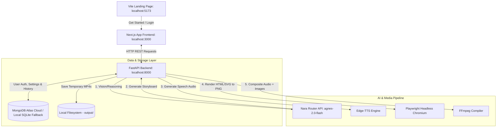

# 🎓 System Architecture: Education AI Video Lesson Generator

This document provides a comprehensive technical overview of the **Education AI Video Lesson Generator** architecture, data flow, pipeline components, and processing mechanics.

---

## 1. High-Level Architecture Overview

Education AI is structured as a decoupled web application with three distinct projects:
1. **Landing Page:** A fast, responsive marketing site built with React + Vite + TailwindCSS.
2. **Main Application Frontend:** An interactive dashboard built with Next.js (App Router) + TailwindCSS + Lucide Icons + Framer Motion.
3. **Application Backend:** A RESTful API built with Python + FastAPI, processing long-running media generation pipelines in the background using multi-threaded execution.

---

## 2. Component Breakdown

The project repository is split into backend services (in the root and `src/` directory) and frontend client projects.

### Frontend Systems
* **Vite Landing Page (`landing_page/`):** High-performance marketing landing page styled using Tailwind CSS, mimicking modern SaaS layouts. Features a call-to-action button that redirects the user to the main application dashboard (`http://localhost:3000`).
* **Next.js Web Console (`frontend/`):** Built with Next.js 16 (Turbopack) using React hooks. Includes email validation, login, and registration portals, user profile manager, setting sliders, and the video creation control panel which polls task progression and renders generated videos.

### Backend Services (`api.py` & `src/`)
* **API Entrypoint (`api.py`):** Configures FastAPI routes, mounts CORS middleware, exposes endpoints for user management, tasks, and settings, and interfaces with the orchestrator.
* **Database Driver (`src/database.py`):** Handles persistence. Automatically detects the presence of the `MONGODB_URI` environment variable to connect to **MongoDB Atlas Cloud**. If absent or offline, it falls back seamlessly to a local **SQLite** database (`education_ai.db`).
* **Authentication Service (`src/auth.py`):** Provides SHA-256 password hashing, validation, and profile management.
* **Email & Verification Utility (`src/email_utils.py`):** Handles SMTP protocols using Google's App Passwords to send 6-digit OTP verification codes during user registration.
* **Background Tasks Worker (`src/tasks.py`):** Spawns separate threads to handle media generation asynchronously without blocking FastAPI's main request loop.
* **Pipeline Orchestrator (`src/orchestrator.py`):** Chains the AI pipeline, TTS engine, slide renderer, and video composer sequentially, logging step percentages back to MongoDB.
* **AI Analysis & Storyboarding Pipeline (`src/ai_pipeline.py`):** Analyzes uploaded problem diagrams/images or text prompts, yielding structured storyboard steps using DeepSeek-based models on the Nara Router.
* **Slide Renderer (`src/renderer.py`):** Generates premium pixel-perfect slide images by compiling HTML/Jinja2 templates into screenshots using Playwright Chromium.
* **Text-To-Speech Engine (`src/tts_engine.py`):** Synthesizes Uzbek narration tracks for slides using Edge-TTS, including custom mathematical variable spellings.
* **Video Compositor (`src/video_composer.py`):** Compiles slide images and synthesized audio clips into the final `.mp4` video lessons using FFmpeg.

---

## 3. Detailed Data Flow & Execution Stages

### 3.1. Authentication and Registration Flow
1. **Email verification (OTP):** The user enters their email on the register page. The frontend calls `/api/auth/send-code`.
2. The backend generates a 6-digit OTP, stores it in an ephemeral cache with a **10-minute (600 seconds) expiration**, and dispatches an HTML email to the user via Gmail SMTP.
3. The user inputs the code. The frontend calls `/api/auth/verify-code`. If verified, the user's password is encrypted and stored in MongoDB Atlas, and they are logged in.

### 3.2. Video Generation Pipeline
When a user submits a task (text prompt and/or uploaded diagram/math problem):

#### Stage 1: Vision & Reasoning (AI Pipeline)
1. The backend inserts a new task document in MongoDB with a `PENDING` status.
2. A request is dispatched to the **Nara Router** (`agnes-2.0-flash`) to parse the math problem or diagram text.
3. The model returns a structured JSON payload representing the problem's components and variables.

#### Stage 2: Storyboard & Custom SVG Generation
1. The parsed variables are sent back to the AI model to build a maximum of 4 storyboard scenes (Introduction $\rightarrow$ Step 1 $\rightarrow$ Step 2 $\rightarrow$ Conclusion/Answer).
2. For geometry or diagram-heavy problems, the model populates the `custom_svg` field with dynamically computed inline HTML5 SVG vector code representing the problem coordinates.
3. The model generates the narration text (`speech`) for each scene.

#### Stage 3: Uzbek Voiceover Generation (TTS)
1. The orchestrator iterates through each scene and normalizes the `speech` text.
2. **Uzbek Variable Phonetics:** Mathematical variables are phonetically translated into text to prevent robotic or mispronounced voiceovers (e.g., `x` $\rightarrow$ `iks`, `y` $\rightarrow$ `igrek`, `z` $\rightarrow$ `zet`, `S` $\rightarrow$ `es`).
3. The text is synthesized into a `.wav` file for each slide using the `Edge-TTS` Uzbek voiceover package.

#### Stage 4: Slide Rendering (HTML $\rightarrow$ PNG)
1. Headless **Playwright Chromium** compiles premium HTML/CSS slides styled with glassmorphism, outfit fonts, and KaTeX mathematical formula rendering.
2. Inline custom SVG codes are rendered directly within the slide. Playwright captures a high-resolution PNG screenshot once assets are loaded.

#### Stage 5: Video Compilation (FFmpeg)
1. The slide PNG images and synthesized audio WAV clips are paired together into temporary `.mp4` video clips.
2. The clips are concatenated together using FFmpeg to output the final `.mp4` video lesson.
3. The output is saved to the `output/` directory and the MongoDB task state is set to `COMPLETED`.

#### Stage 6: Frontend Video Playback
1. The Next.js frontend polls `/api/tasks/{task_id}` for progression status.
2. Once `COMPLETED`, the FastAPI backend reads the generated `.mp4` file from the disk, encodes it into a **Base64** string, and returns it in the API response.
3. The frontend decodes the Base64 string into a data URL and renders it directly inside the browser's `<video>` tag for immediate viewing and downloading.

---

## 4. Deployment Architecture (Heroku Specifics)

When deploying this project to a platform like Heroku:

* **Separate Apps:** The backend API and Next.js frontend are deployed as two separate Heroku applications.
* **PostgreSQL vs MongoDB:** Although Heroku dynos have an ephemeral filesystem, **database persistence is secure** since all user settings and task history data are stored directly in MongoDB Atlas Cloud (via the `MONGODB_URI` environment variable).
* **Ephemeral Video Files:** The generated `.mp4` video files are saved on the local Heroku dyno filesystem (`output/` folder). Because Heroku restarts dynos at least once every 24 hours, **videos are temporarily stored for up to 24 hours**. Users are prompted to download their generated videos immediately, as older history videos become unavailable after a dyno restart.
* **FFmpeg and Playwright Buildpacks:** The backend Heroku app requires additional buildpacks (`heroku-community/apt` or specific custom buildpacks) to install the system dependencies for **FFmpeg** and **Playwright Chromium** on the headless Linux server.
